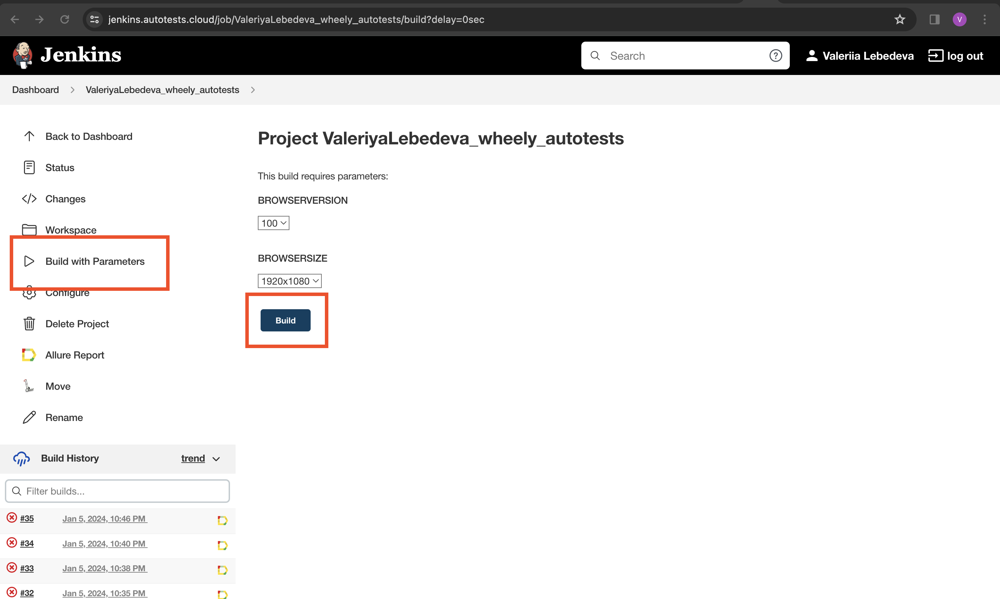
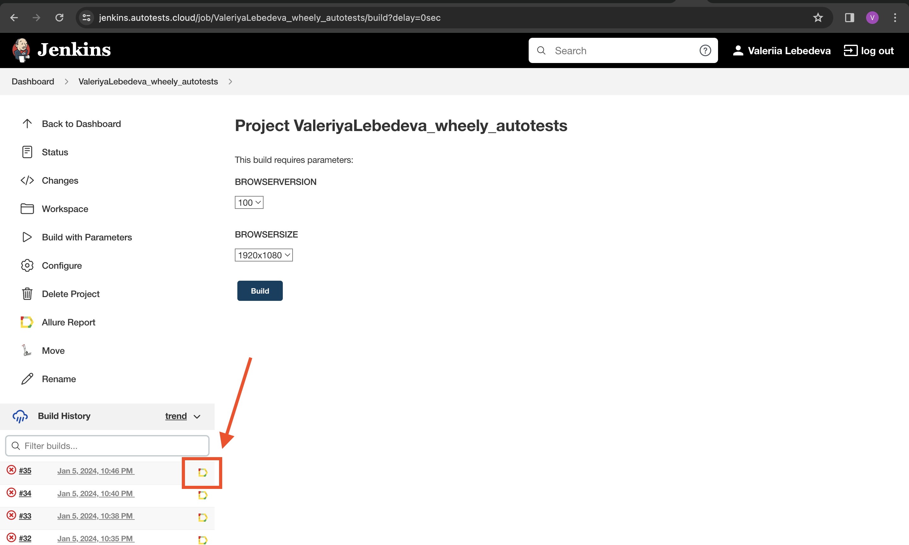
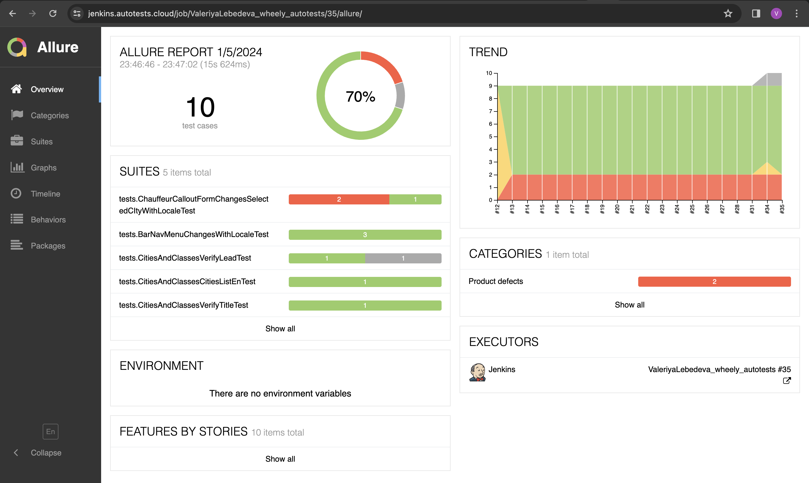
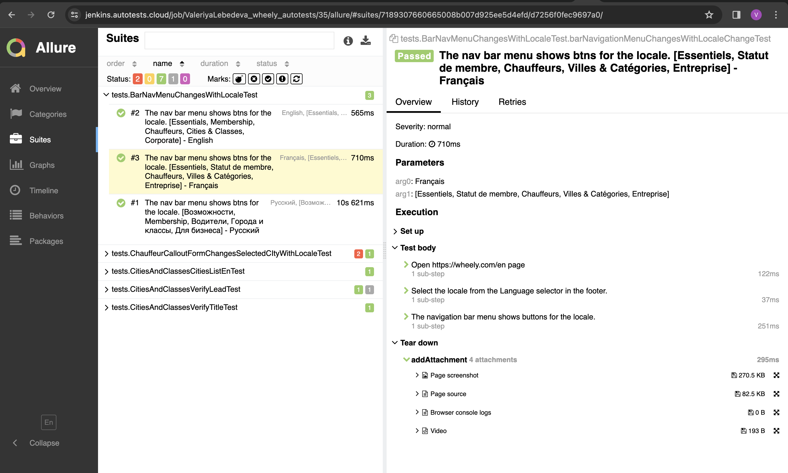
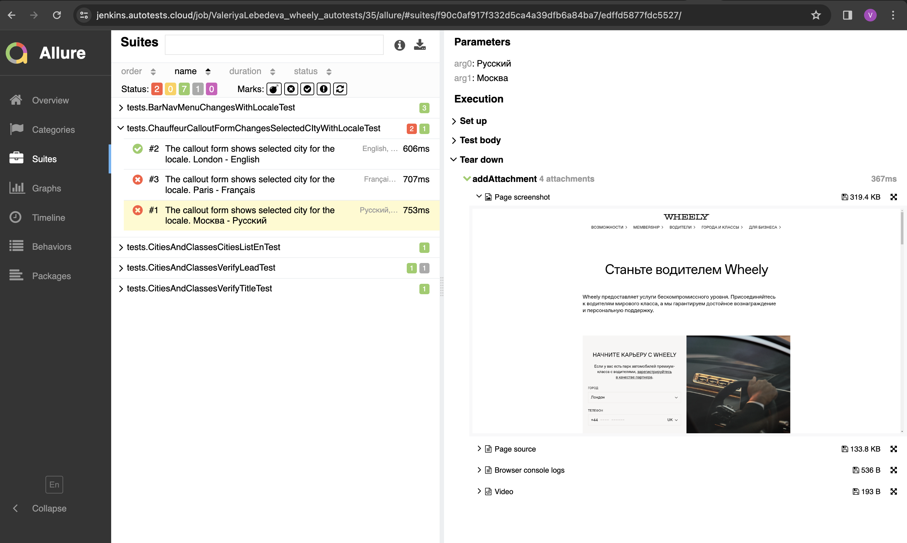
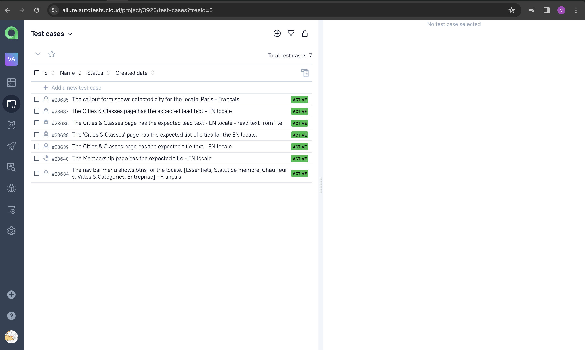
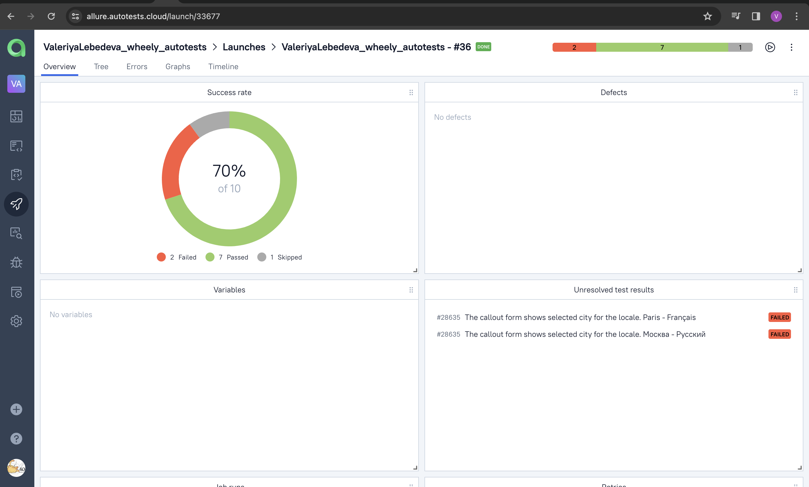
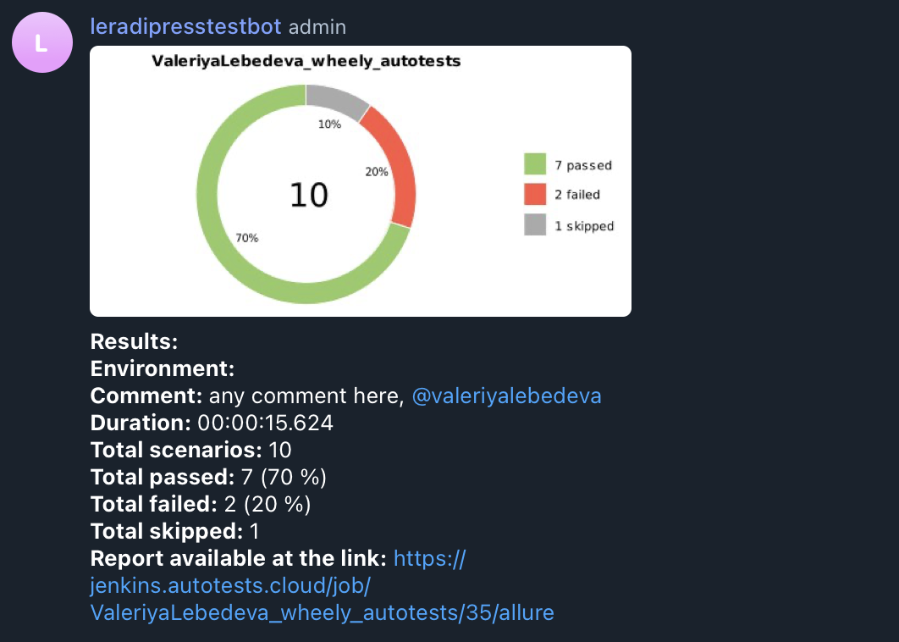

# UI WEB tests

### https://wheely.com/en

# Test-cases
1. The navigation bar menu shows expected buttons for the selected locale.
2. The chauffeur page. The callout form shows expected selected city corresponds to selected locale.
3. The 'Cities & Classes' page has the expected list of cities for the EN locale.
4. The Cities & Classes page has the expected lead text - EN locale.
5. The Cities & Classes page has the expected title text - EN locale.


# Used technologies

<p  align="center">


</p>

# USAGE examples
## Run tests from terminal
### Run tests with filled remote properties:

```bash
gradle clean test
```

### Run tests with not filled remote properties:

```bash
gradle clean test -DbrowserVersion=${BROWSERVERSION} -DbrowserSize=${BROWSERSIZE}
```

### Running parameters

<code>BROWSERVERSION</code> – browser version (_default - <code>100</code>_).

<code>BROWSERSIZE</code> – browser window size (_default - <code>1920x1080</code>_).

### Serve report:

```bash
allure serve build/allure-results
```


# Jenkins job
### https://jenkins.autotests.cloud/job/ValeriyaLebedeva_wheely_autotests/

How to build project:
1. Click on the 'Build with parameters'
2. Click on the 'Build' button

<p align="center">
  
</p>


# Allure report examples

The results of the build can be viewed in the Allure report by clicking on the icon <code><strong>*Allure Report*</strong></code>.

<p align="center">
  
</p>

Overwiew

<p align="center">
  
</p>

Each test has steps described:
<p align="center">
  
</p>

Each test has last screenshot attached:
<p align="center">
  
</p>

Another attachments you may find here:
https://jenkins.autotests.cloud/job/ValeriyaLebedeva_wheely_autotests/35/allure/

(select suits item -> select test -> enjoy :innocent:)

# Allure TestOps integration

<p align="center">
  
</p>

<p align="center">
  
</p>

# Jira integration
<p align="center">
  
</p>


# Telegram notifications
The project is configured to send launch results notifications to Telegram channel:

<p align="center">
  
</p>


